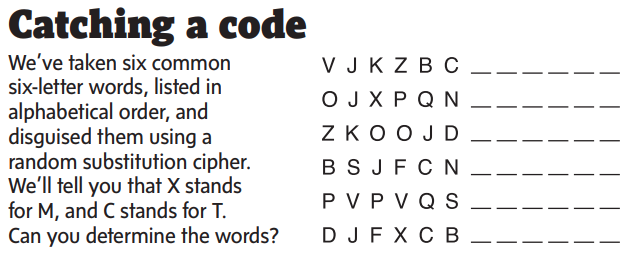

# Cypher Solver

## Overview
Occasionally, the Globe and Mail, on long weekends, prints an extended puzzles section which includes a random substitution cypher puzzle: 

This seems like a pain to solve by hand, so I wanted my computer to be able to do it. So I wrote a little javascript program (based on an even jankier python version)
that will run in your browser and solve these kinds of puzzes. It should work with any number of words, as long as they aren't too obscure, and any number (well, less than 27) of 
substituted letters. You can access a live version of it [here](https://www.souder.ca/Cypher/cypher.html).

## Usage

Enter your enciphered words in the `word` boxes; if you know any letters already, you can enter them in the `stands for` sections. You can add or remove words or known letters
with the buttons, and pressing solve will start it chugging away at finding a solution.

After a while (speed is dependant on how hard the puzzle is and the capacity of your computer), it will tell you the results at the bottom of the page. The program will provide
any keys that solve the given cypher (there may be more than one). If there's only one key, the program will also decrypt and display the ciphered words. 

## How it works

This is not a particularly elegant program; it is at best a slightly fancy brute force attempt against a dictionary. 

First, we generate a 'repetition profile' for each of the ciphered words. This describes the way that letters repeat in the word. Each unique number is assigned a digit, so for 
example, 'Hello' would have the profile `01223`; 'World' has profile `01234`; and 'Test' has `0120`. 

Then, for each word, we find all the words in the dictionary that have the same repetition profile (there's also some sorting by length, to make things easier).
For all the words with the same repetiton profile, we generate a key that relates the cyphered text to one of the possible 'true' combinations. This can often generate thousands of possbile keys.

If there are letters that are known, we go through these keys and discard any that don't match the known letter decriptions.

Then, it is just a matter of comparing and combining all the possible keys from all the words:

We first start by combining the keys from the first two cyphered words. We compare each of the possible keys from the first word with each of the possible keys from the second word.
If two keys "fit together" - i.e. they don't have any conflicting letters - we combine them into a new key, and store the new, reduced set of keys generated by this process together. 

We are then able to do this process for each word's set of keys - combining the just genereated 'new set' from words one and two, for example, with the set of keys from word three, and so on until we exhaust all the words.

If enough information is provided, this will yield a single key (which likley still will have blanks, unless the given words had the entire alphabet between them) and decrypt the words. Otherwise, we'll just display all the possible keys.

## License

This project is licensed under the [GNU General Public License v3.0](https://github.com/Esouder/Cypher/blob/main/LICENSE).
